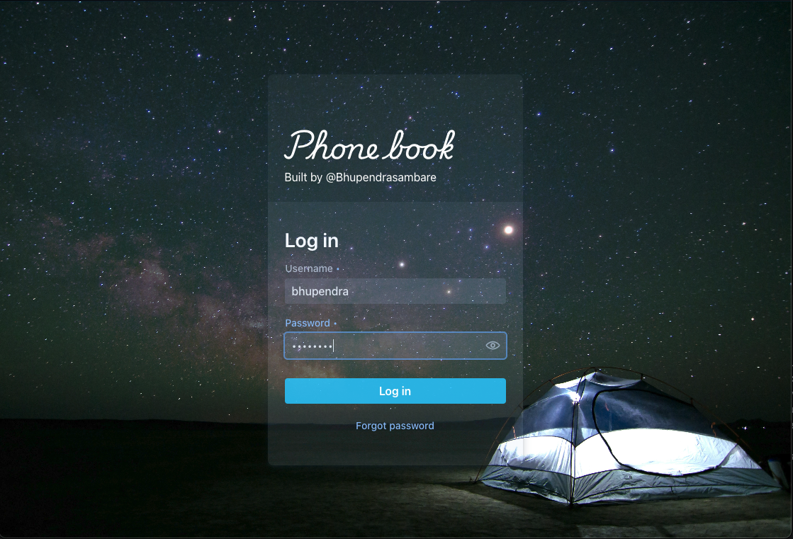
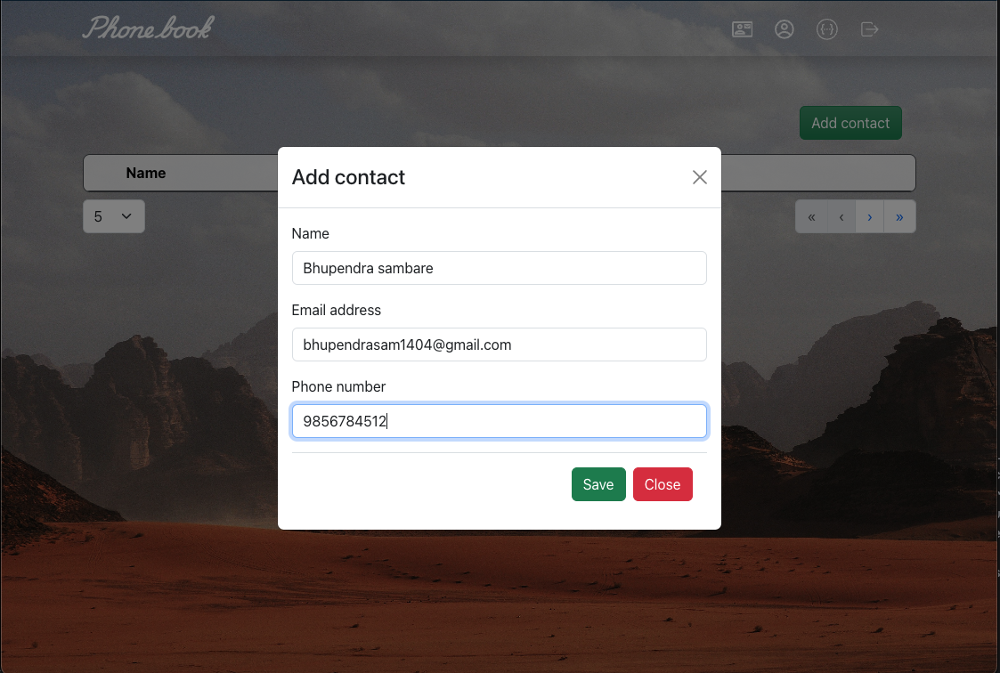
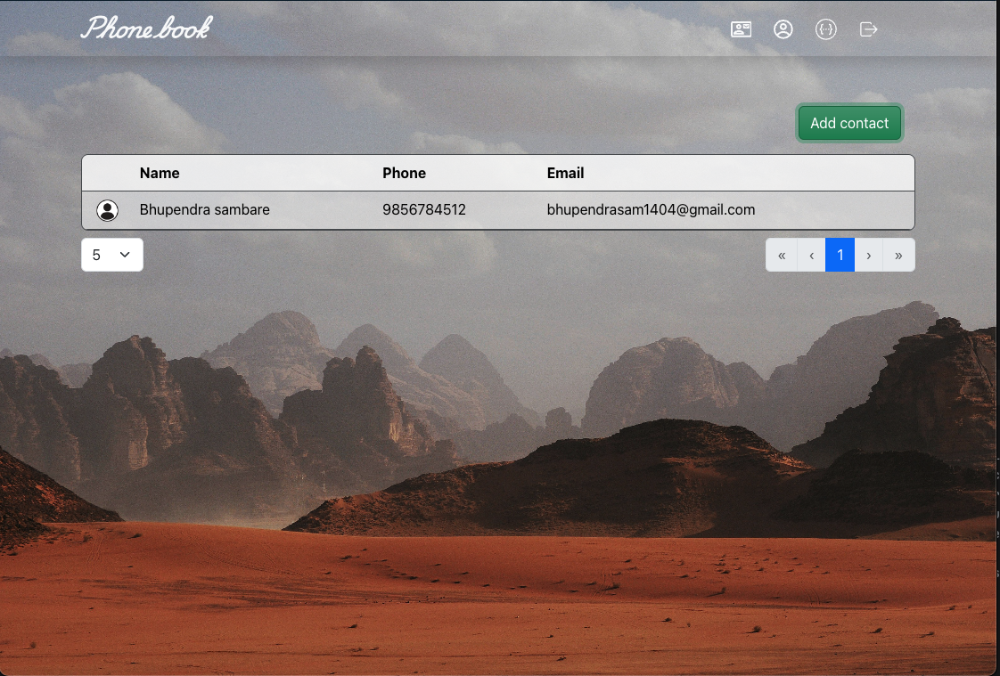
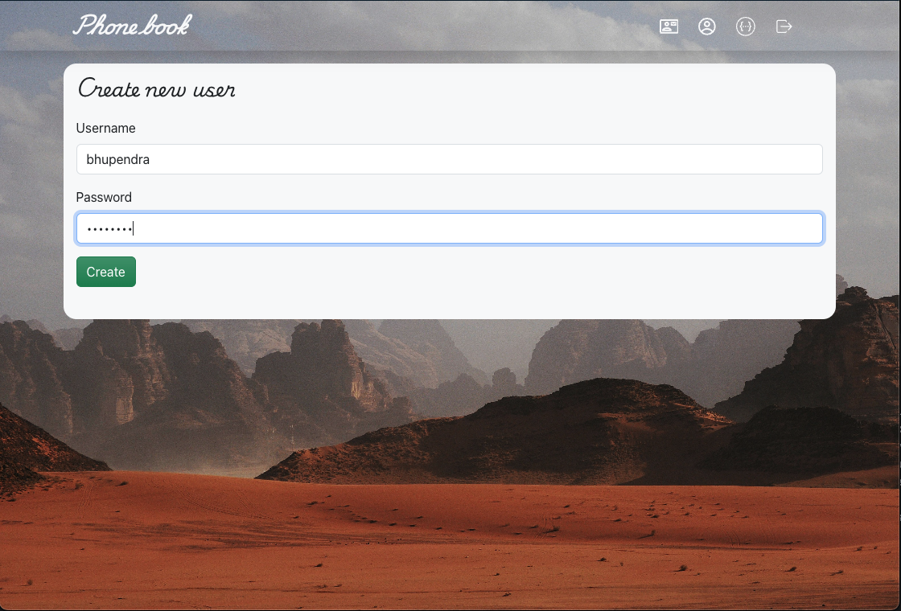
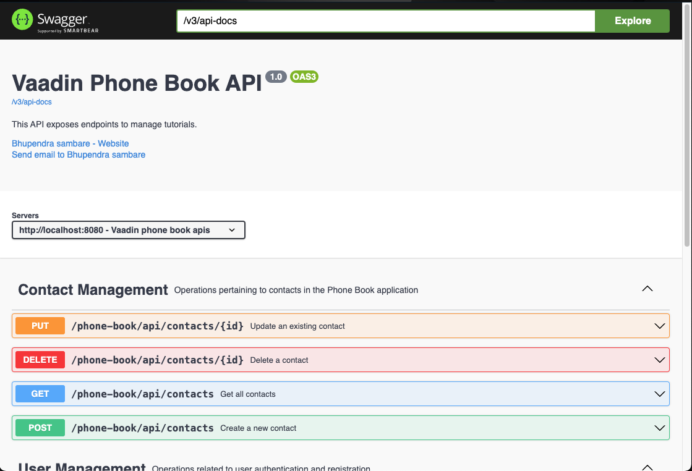

# Phone Book (Spring-Boot + Vaadin Hilla)
```text
Default : username:admin | password:admin
        _                            _                 _    
  _ __ | |__   ___  _ __   ___      | |__   ___   ___ | | __
 | '_ \| '_ \ / _ \| '_ \ / _ \_____| '_ \ / _ \ / _ \| |/ /
 | |_) | | | | (_) | | | |  __/_____| |_) | (_) | (_) |   < 
 | .__/|_| |_|\___/|_| |_|\___|     |_.__/ \___/ \___/|_|\_\
 |_|   
```

This project demonstrates the integration of Vaadin and Hilla with Spring Boot to create a full-stack application. By combining the power of Vaadin for seamless UI development with the flexibility of React.js, this project showcases how to build a highly reusable and modular full-stack application. The integration of React.js enhances the application by allowing the inclusion of rich, interactive components while maintaining the robustness of a Spring Boot backend.

## Features

- **Full-Stack Integration**: Combines Vaadin's server-side UI components with React.js for client-side interactivity.
- **Reusability**: Integrates React.js packages to maximize code reusability and reduce redundancy.
- **Responsive UI**: Leverages Vaadin's powerful UI framework to create a responsive and attractive user interface.
- **Spring Boot Backend**: Utilizes Spring Boot for backend services, ensuring a robust and scalable application structure.
- **Hilla Integration**: Enhances the application's capabilities with Hilla, providing seamless communication between the frontend and backend.

## Technologies Used

- **Spring Boot**: Backend framework providing a strong foundation for building Java-based applications.
- **Vaadin**: A modern web framework for building responsive and accessible UIs using Java.
- **Hilla**: A toolkit for building reactive applications, providing efficient data communication between the frontend and backend.
- **React.js**: JavaScript library for building user interfaces, enabling the development of dynamic and interactive web applications.
- **Java**: Core programming language for the backend logic and services.
- **H2 Database**: For lightweight and ease-to-use we are using H2-Database.
- **TypeScript**: Used in combination with React.js for building robust and type-safe frontend components.

## Running the application

1. Clone the repository:
```bash
git clone https://github.com/bhupendrasambare/PhoneBook-SpringBoot-Vaadin-Hilla.git
cd PhoneBook-SpringBoot-Vaadin-Hilla
```
2. Build the project:
- Local
```bash
./mvn clean install
```
- Production
```bash
./mvn clean install -Pproduction
```

3. Run the application:
```bash
./mvn spring-boot:run
```
4. Visit web:
```url
http://localhost:8081/login
```

## Deploying to Production

To create a production build, call `mvnw clean package -Pproduction` (Windows),
or `./mvnw clean package -Pproduction` (Mac & Linux).
This will build a JAR file with all the dependencies and front-end resources,
ready to be deployed. The file can be found in the `target` folder after the build completes.

Once the JAR file is built, you can run it using
`java -jar target/myapp-1.0-SNAPSHOT.jar` (NOTE, replace
`myapp-1.0-SNAPSHOT.jar` with the name of your jar).

## Screenshots
# Login

# Add Contact

# Contacts

# Create New User

# Swagger
